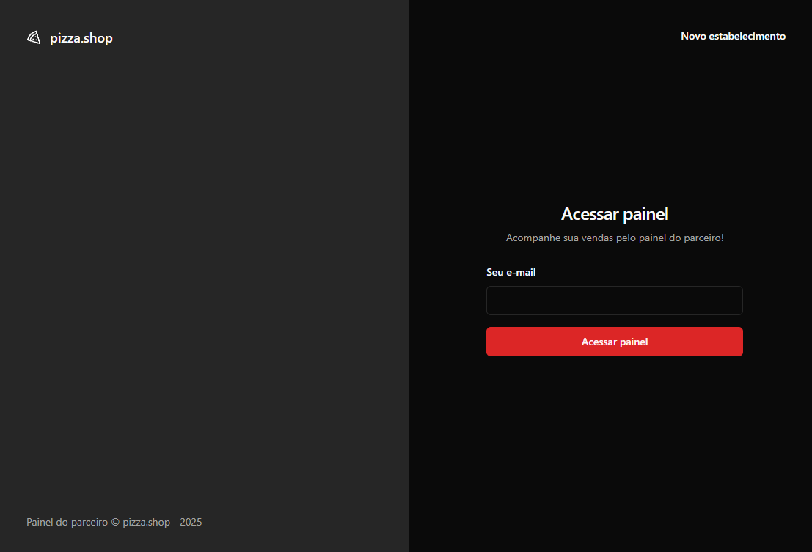
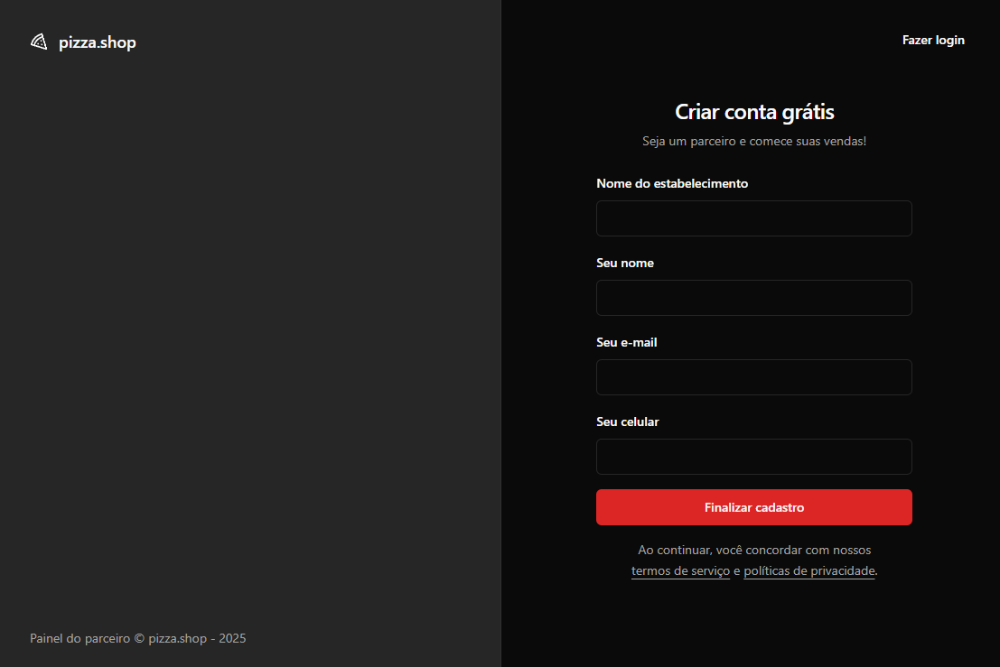
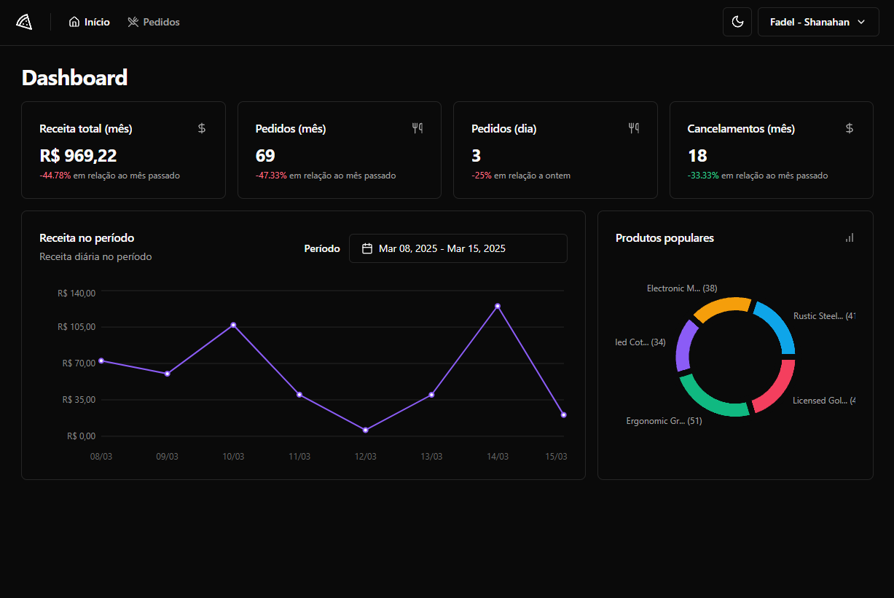
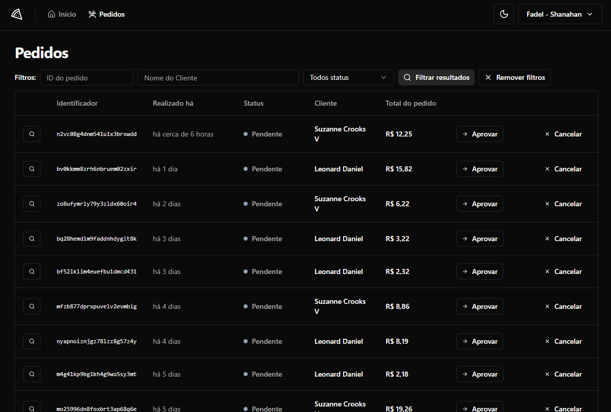

# 🍕 Pizza Shop

### Sistema de Vendas para Pizzarias

O **Pizza Shop** é um frontend responsivo para um sistema de vendas de pizzas e outros produtos. O sistema permite gestão e manipulação de pedidos com dashboard de estatísticas das vendas. O projeto foi feito baseado em um backend real.

## 🚀 Tecnologias Utilizadas

- **Framework**: React + Vite
- **Estilização**: Tailwind CSS + ShadCN
- **Gerenciamento de Estado**: React Hook Form + Zod
- **Roteamento**: React Router DOM
- **Requisições HTTP**: Axios
- **Componentização**: Radix UI
- **Testes**: Playwright, Testing Library e Vitest
- **Gráficos**: Recharts

---

## 📂 Estrutura de Pastas

A estrutura de pastas do projeto está organizada da seguinte maneira:

```
📦 pizzashop-web
├── 📂 node_modules
├── 📂 playwrigth-report
├── 📂 public
├── 📂 src
│   ├── 📂 api
│   │   ├── mocks das chamadas a API
│   │   ├── chamadas a API
│   ├── 📂 components
│   │   ├── 📂 ui
│   │   │   ├── account-menu.tsx
│   │   │   ├── header.tsx
│   │   │   ├── nav-link.tsx
│   │   │   ├── order-status.tsx
│   │   │   ├── pagination.tsx
│   │   │   ├── store-profile-dialog.tsx
│   ├── 📂 lib
│   │   ├── axios.ts
│   │   ├── react-query.ts
│   │   ├── utils.ts
│   ├── 📂 pages
│   │   ├── 📂 Layouts
│   │   ├── 📂 app
│   │   │   ├── 404.tsx
│   │   │   ├── error.tsx
│   │   │   ├── app.tsx
│   │   │   ├── main.tsx
│   │   │   ├── routes.tsx
│   │   │   ├── global.css
│   ├── 📂 test
│   │   ├── dashboard.e2e-spec.ts
│   │   ├── orders.e2e-spec.ts
│   │   ├── sign-in2.e2e-spec.ts
│   │   ├── sign-up.e2e-spec.ts
│   │   ├── store-profile.e2e-spec.ts
│   ├── 📄 vite.env.ts
│   ├── 📄 .eslint.json
├── 📄 .env.local
```

---

## 📦 Instalação e Configuração

### 1️⃣ Clonar o Repositório

```sh
git clone https://github.com/rodgondin/pizza.shop.git
cd pizzashop-web
```

### 2️⃣ Instalar as Dependências

```sh
npm install
```

### 3️⃣ Executar o Frontend

```sh
npm run dev
```

---

## 📌 Funcionalidades Principais

- 📱 **Interface responsiva** para pedidos
- 📊 **Dashboard administrativo** para gestão dos pedidos
- 🏷️ **Gerenciamento de pedidos** (aprovação, cancelamento, histórico)
- 🔐 **Login e Cadastro de contas** para utilização da plataforma

---

## 🖼️ Screenshots

### 📌 Tela de Login



### 📌 Tela de Cadastro



### 📌 Dashboard



### 📌 Lista de Pedidos



---

💡 **Projeto de estudo fornecido pela @Rocketseat.** 🚀
